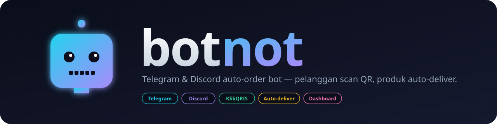

<p align="center">
  
</p>

<p align="center">
  <b>Bot auto-order untuk Telegram &amp; Discord, terintegrasi dengan <a href="https://klikqris.com">KlikQRIS</a> (QRIS Indonesia).</b><br>
  Pelanggan tinggal scan QR &mdash; produk dikirim otomatis lewat DM begitu pembayaran masuk.
</p>

<p align="center">
  <a href="#license"></a>
  
  
  
  
</p>

---

## Daftar Isi

- [Fitur](#fitur)
- [Cara Kerja](#cara-kerja)
- [Tech Stack](#tech-stack)
- [Quick Start](#quick-start)
- [Cara Dapat Kredensial](#cara-dapat-kredensial)
  - [Telegram Bot Token](#1-telegram-bot-token)
  - [Discord Bot Token](#2-discord-bot-token)
  - [KlikQRIS API Key](#3-klikqris-api-key)
- [Konfigurasi `.env`](#konfigurasi-env)
- [Setup Wizard (`npm run setup`)](#setup-wizard-npm-run-setup)
- [Webhook Public URL](#webhook-public-url)
- [Owner System](#owner-system)
- [Admin Dashboard](#admin-dashboard)
- [Analytics](#analytics)
- [Admin Commands (Bot)](#admin-commands-bot)
- [Struktur Project](#struktur-project)
- [Perintah Bot](#perintah-bot)
- [Deploy ke Production](#deploy-ke-production)
- [Roadmap](#roadmap)
- [Kontribusi](#kontribusi)
- [License](#license)

---

## Fitur

- **Multi-platform**: Telegram + Discord dari satu codebase, satu database, satu webhook.
- **QRIS dinamis**: tiap order dapet QR unik via API KlikQRIS, scan pakai e-wallet apa pun (GoPay, OVO, Dana, ShopeePay, m-banking, dll).
- **Auto-deliver**: stok (akun, license key, voucher, file) otomatis dikirim ke DM pembeli setelah pembayaran terkonfirmasi.
- **Inline button UX**: bot pakai tombol interaktif (gak perlu hafalin command) — Telegram InlineKeyboard, Discord ButtonBuilder + SelectMenu.
- **Setup wizard**: `npm run setup` buka browser otomatis ke form web yang ngisi `.env` untuk kamu — gak perlu edit file manual.
- **Owner-aware bots**: bot kenal siapa owner-nya. Owner otomatis admin + dapet notifikasi (bot online, order baru, delivery gagal). Slash command `/whoami` untuk cek role.
- **Admin web dashboard**: kelola produk, stok, order, plus halaman **analytics** (chart revenue 30 hari, top produk, breakdown per platform).
- **Admin bot commands**: kelola toko langsung dari Telegram/Discord — tambah produk, restok, lihat orderan, kirim ulang produk yang gagal terkirim.
- **Idempotent webhook**: pengecekan status di DB mencegah kirim produk dobel kalau callback masuk berulang.
- **Signature validation**: webhook divalidasi dengan signature yang disimpan saat create transaction (anti fake-callback).
- **Stock management**: alokasi stok pakai DB transaction, anti race condition kalau dua orang beli barengan.
- **Retry-safe delivery**: kalau DM gagal terkirim, stok tetap teralokasi dan admin bisa kirim ulang dari dashboard tanpa double-claim stok.
- **Auto-expire**: order PENDING yang lewat waktu otomatis di-mark EXPIRED via cron job (jalan tiap 1 menit).
- **Rate limiting**: `/admin/login` di-protect dari brute force (max 10 attempt per 5 menit per IP).
- **Graceful degradation**: bot tetap jalan walau kredensial KlikQRIS belum diisi (cuma `/buy` yang gagal sampai diisi).
- **Configurable**: SQLite untuk dev, tinggal ganti `DATABASE_URL` ke Postgres untuk production.

## Cara Kerja

```
  ┌─────────────┐     ┌─────────────┐
  │  Telegram   │     │   Discord   │
  │  pelanggan  │     │  pelanggan  │
  └──────┬──────┘     └──────┬──────┘
         │ /buy <id>         │ /buy product_id:<id>
         ▼                   ▼
       ┌─────────────────────────┐
       │       botnot core       │
       │  (Fastify + grammy +    │
       │       discord.js)       │
       └────┬───────────────┬────┘
            │               │
            │ create        │ store order
            ▼               ▼
       ┌──────────┐    ┌──────────┐
       │ KlikQRIS │    │ Database │
       └────┬─────┘    └────▲─────┘
            │ webhook PAID   │ update + allocate stok
            └────────────────┘
                     │
                     ▼ DM pembeli
                ┌─────────┐
                │ Produk  │
                │ terkirim│
                └─────────┘
```

1. Pembeli ketik `/buy <product_id>` di Telegram atau Discord.
2. Bot panggil `/qris/create` ke KlikQRIS, simpan `signature` & `total_amount` di DB.
3. Bot kirim gambar QR + nominal + waktu kadaluarsa ke pembeli.
4. Pembeli scan QR, bayar pakai e-wallet apa pun.
5. KlikQRIS hit `POST /webhook/klikqris` di server kamu.
6. Webhook handler:
   1. Validasi signature.
   2. Cek idempotency (kalau sudah `PAID`, abaikan).
   3. Update status order ke `PAID`.
   4. Alokasi stok dalam DB transaction.
   5. Kirim produk lewat DM Telegram/Discord.

## Tech Stack

| Layer        | Tool                                        |
| ------------ | ------------------------------------------- |
| Runtime      | Node.js 20+ (ESM, NodeNext)                 |
| Bahasa       | TypeScript 5                                |
| Telegram bot | [grammy](https://grammy.dev)                |
| Discord bot  | [discord.js](https://discord.js.org) v14    |
| HTTP server  | [Fastify](https://fastify.dev) v5           |
| ORM          | [Prisma](https://www.prisma.io)             |
| DB           | SQLite (dev) / PostgreSQL (prod)            |
| Validasi env | [zod](https://zod.dev)                      |
| Logging      | [pino](https://getpino.io) + pino-pretty    |
| HTTP client  | axios                                       |

---

## Quick Start

> Butuh **Node.js 20+** dan **npm** (atau pnpm/yarn).

**Cara paling cepat (recommended) — 4 command:**

```bash
git clone https://github.com/mocasus/botnot.git
cd botnot
npm install
npm run setup       # bikin .env, migrate DB, buka browser otomatis ke form config
```

### Apa yang akan kamu lihat

`npm run setup` ngerjain ini semua otomatis:

1. Bikin `.env` dari `.env.example` (kalau belum ada)
2. Migrate database (`prisma db push`)
3. Start dev server
4. **Auto-buka browser** ke `http://localhost:3000/setup` — form web untuk isi semua kredensial

> **Halaman pertama yang muncul = Setup Wizard di `/setup`.**
> Bukan dashboard. Dashboard baru aktif setelah kamu isi `ADMIN_USERNAME` & `ADMIN_PASSWORD` di form ini, lalu **restart server**.

### Setelah submit form setup

```bash
# 1. Stop dev server yang lagi jalan
Ctrl+C

# 2. Restart untuk apply config baru
npm run dev

# 3. Buka dashboard
# http://localhost:3000/admin
# Login pakai username/password yang barusan kamu set
```

Sekarang baru kamu lihat **Admin Dashboard** dengan desain modern (glass-morphism, dark theme, mobile responsive).

**Cara manual (kalau mau edit `.env` langsung):**

```bash
cp .env.example .env
# edit .env pakai editor favorit kamu (panduan lengkap di "Cara Dapat Kredensial")
npm run db:push
npm run db:seed     # opsional: isi contoh produk
npm run dev
```

### Dashboard nggak berubah desainnya?

Kalau habis update kode tapi UI dashboard masih kelihatan lama:

```bash
# 1. Pastikan branch up-to-date
git pull origin main

# 2. Reinstall deps (siapa tahu ada lockfile diff)
npm install

# 3. Hard restart dev server (bukan cuma reload browser)
Ctrl+C
npm run dev

# 4. Hard refresh browser
# Chrome/Edge: Ctrl+Shift+R (Windows) atau Cmd+Shift+R (Mac)
# Firefox: Ctrl+F5
```

Browser sering cache TailwindCSS CDN + HTML. Hard refresh wajib.

Output kira-kira (first-run, sebelum setup):

```
╔════════════════════════════════════════════════════════╗
║   First-run detected — buka setup wizard di browser:   ║
║   →  http://localhost:3000/setup                       ║
║   Atau jalanin: npm run setup (auto-buka browser)      ║
╚════════════════════════════════════════════════════════╝
```

Output setelah `.env` sudah dikonfigurasi:

```
[12:34:56] INFO: HTTP server listening port=3000
[12:34:56] INFO: Admin dashboard ready url=http://localhost:3000/admin
[12:34:57] INFO: Telegram bot started username=botnot_bot
[12:34:58] INFO: Discord slash commands registered scope=guild count=10
[12:34:58] INFO: Discord bot ready tag=botnot#1234
```

Buka chat Telegram dengan bot kamu, ketik `/start` &mdash; siap testing!

---

## Cara Dapat Kredensial

### 1. Telegram Bot Token

1. Buka aplikasi Telegram, search **`@BotFather`** dan mulai chat.
2. Kirim perintah: `/newbot`
3. BotFather minta 2 hal:
   - **Display name** (bebas, misal: `Toko Otomatis`)
   - **Username** (harus unik & diakhiri `bot`, misal: `tokootomatis_bot`)
4. BotFather balas dengan token format:
   ```
   123456789:ABCdefGhIJklmNOpqrSTUvwxYZ-1234567890
   ```
   Copy token ini ke `TELEGRAM_BOT_TOKEN` di `.env`.
5. **Opsional** &mdash; biar bot keliatan rapi:
   - `/setdescription` — deskripsi bot
   - `/setuserpic` — kirim gambar untuk avatar
   - `/setcommands` — daftar command yang muncul di tombol menu, contoh:
     ```
     start - Mulai
     catalog - Lihat daftar produk
     buy - Beli produk
     ```

### 2. Discord Bot Token

1. Buka **[Discord Developer Portal](https://discord.com/developers/applications)** dan login.
2. Klik **`New Application`**, kasih nama (misal: `Botnot`), klik **Create**.
3. Di sidebar pilih **`Bot`**:
   - Klik **`Reset Token`** &rarr; copy token-nya. **Token cuma muncul sekali!** Simpan ke `DISCORD_BOT_TOKEN`.
   - (Opsional) Matikan toggle **`Public Bot`** kalau bot ini private.
4. Di sidebar pilih **`General Information`**:
   - Copy **`Application ID`** &rarr; ini yang kita pakai sebagai `DISCORD_CLIENT_ID` di `.env`.
5. **Invite bot ke server kamu**:
   - Sidebar &rarr; **`OAuth2`** &rarr; **`URL Generator`**.
   - Centang scope: `bot`, `applications.commands`.
   - Centang Bot Permissions: `Send Messages`, `Embed Links`, `Attach Files`, `Use Slash Commands`.
   - Copy URL yang dihasilkan, buka di browser, pilih server, klik **Authorize**.
6. **Opsional &mdash; Guild ID untuk testing cepat**:
   - Slash command global butuh waktu propagasi sampai 1 jam. Untuk dev, daftarkan ke 1 guild aja biar instan.
   - Aktifkan Developer Mode: Discord &rarr; Settings &rarr; Advanced &rarr; **Developer Mode** ON.
   - Right-click icon server kamu &rarr; **Copy Server ID** &rarr; paste ke `DISCORD_GUILD_ID` di `.env`.
   - Untuk production, kosongkan `DISCORD_GUILD_ID` biar pakai global commands.

> **Catatan penting Discord:** bot hanya bisa kirim DM ke user yang **berbagi minimal satu server** dengan bot. Buat server "lobby" dan minta pelanggan join sebelum membeli, atau kirim hasil order ke channel publik dengan @mention sebagai fallback.

### 3. KlikQRIS API Key

1. Daftar/login akun merchant di **[klikqris.com](https://klikqris.com)**.
2. Buka dashboard merchant, copy:
   - `x-api-key` &rarr; isi ke `KLIKQRIS_API_KEY`
   - `id_merchant` &rarr; isi ke `KLIKQRIS_MERCHANT_ID`
3. Daftarkan **Webhook URL** kamu di dashboard, format:
   ```
   https://<domain-public-kamu>/webhook/klikqris
   ```
4. **JANGAN PERNAH** commit `.env` ke git. File `.gitignore` sudah meng-ignore `.env*` (kecuali `.env.example`).

---

## Konfigurasi `.env`

> **Tip:** pakai **[Setup Wizard](#setup-wizard-npm-run-setup)** (`npm run setup`) untuk isi semua ini lewat form web — lebih gampang daripada edit manual.

```bash
NODE_ENV=development
PORT=3000

# KlikQRIS — boleh dikosongkan untuk dev, /buy gagal sampai diisi
KLIKQRIS_API_BASE=https://klikqris.com/api
KLIKQRIS_API_KEY=          # x-api-key dari dashboard
KLIKQRIS_MERCHANT_ID=      # id_merchant

# Telegram — kosongkan untuk disable
TELEGRAM_BOT_TOKEN=        # dari @BotFather

# Discord — kosongkan untuk disable
DISCORD_BOT_TOKEN=         # dari Developer Portal > Bot
DISCORD_CLIENT_ID=         # = Application ID
DISCORD_GUILD_ID=          # opsional, isi untuk dev (slash command instan)

# Owner — primary admin yg dapet notifikasi event penting (bot online, sales, delivery fail)
# Owner OTOMATIS termasuk admin, gak perlu didouble di ADMIN_*_IDS.
OWNER_TELEGRAM_ID=         # numeric ID, dapet dari @userinfobot
OWNER_DISCORD_ID=          # numeric ID, Developer Mode > Copy User ID

# Admin tambahan (selain owner) untuk bot commands
ADMIN_TELEGRAM_IDS=        # contoh: 12345,67890
ADMIN_DISCORD_IDS=         # contoh: 1112,3334

# Admin web dashboard — kosongkan ADMIN_USERNAME untuk disable + auto-aktifin /setup
ADMIN_USERNAME=
ADMIN_PASSWORD=
ADMIN_SESSION_SECRET=      # generate: openssl rand -hex 32 (atau setup wizard auto-gen)

# Database
DATABASE_URL="file:./dev.db"

# Webhook
PUBLIC_BASE_URL=           # contoh: https://abc123.ngrok.io
```

---

## Setup Wizard (`npm run setup`)

Form web di `/setup` untuk ngisi semua env vars tanpa edit `.env` manual.

**Cara pakai:**

```bash
npm run setup
```

Yang terjadi:
1. Auto-create `.env` dari `.env.example` kalau belum ada
2. Migrate database (`prisma db push`) — bikin tabel SQLite kalau belum ada
3. Start server
4. Auto-buka browser ke `http://localhost:3000/setup` (cross-platform: macOS/Linux/Windows)
5. Form punya section: Server, KlikQRIS, Telegram, Discord, Owner, Admin tambahan, Web Dashboard, Database
6. Kalau lupa generate session secret, ada tombol **Generate** yang bikin string random
7. Submit → `.env` lama di-backup (`.env.bak.<timestamp>`) → file baru ditulis dengan format rapi
8. Pesan konfirmasi muncul, instruksi restart (Ctrl+C → `npm run dev`)

**Kapan setup wizard aktif:**

- Selalu aktif di `NODE_ENV=development` (boleh re-config kapan aja)
- Aktif kalau `ADMIN_USERNAME` belum diset (first-run detection)
- **Otomatis disabled** di production yang sudah configured — `/setup` redirect ke `/admin/login`

**Security:**

- Hanya key di allowlist yang ditulis (anti-injection)
- Validasi minimal (password ≥ 8 karakter, username wajib)
- Backup `.env` lama sebelum overwrite
- Sensitive values (token, password, secret) dilog sebagai `<set>` / `<empty>` aja

**Bisa diakses langsung tanpa wizard launcher:** kalau server udah jalan via `npm run dev`, tinggal buka `http://localhost:3000/setup` di browser.

---

## Webhook Public URL

KlikQRIS perlu URL public untuk kirim callback. Untuk testing lokal, pakai tunnel:

**Pakai ngrok**:

```bash
# install: https://ngrok.com/download
ngrok http 3000
# copy URL https://xxxx.ngrok.io
# daftarkan https://xxxx.ngrok.io/webhook/klikqris di dashboard KlikQRIS
```

**Pakai Cloudflare Tunnel** (gratis, tanpa daftar):

```bash
cloudflared tunnel --url http://localhost:3000
```

Untuk production: deploy ke VPS / Railway / Fly.io / Render dan pakai domain HTTPS milik kamu.

---

## Owner System

Bot kenal siapa **owner**-nya — primary admin yang dapat perlakuan khusus.

**Setup owner:**

Cukup isi `OWNER_TELEGRAM_ID` dan/atau `OWNER_DISCORD_ID` di `.env` (atau via setup wizard).

```bash
# Cara dapat numeric user ID:
# Telegram: chat @userinfobot, dia kirim ID-mu
# Discord: Settings > Advanced > Developer Mode ON, klik kanan profil > Copy User ID
OWNER_TELEGRAM_ID=123456789
OWNER_DISCORD_ID=987654321098765432
```

**Apa yang owner dapet otomatis:**

| Event | Notifikasi ke owner |
| --- | --- |
| Bot online (saat startup) | "Bot Online — siap menerima order" |
| Order PAID + delivered | "Penjualan baru: produk X x2, Rp50.000, by @user" |
| Delivery gagal | "Delivery GAGAL — order X, error: ..., cek dashboard" |

**Owner = Admin (otomatis):**

Owner ID otomatis ditambahkan ke daftar admin, jadi punya akses semua admin commands & dashboard tanpa perlu listing dirinya 2x di `ADMIN_*_IDS`.

**Cek role kamu sendiri:**

- Telegram: `/whoami`
- Discord: `/whoami`

Bot akan reply dengan role kamu (`Owner` / `Admin` / `Customer`) plus user ID + username.

---

## Admin Dashboard

Web UI untuk kelola toko dari browser. Auto-aktif saat `ADMIN_USERNAME` & `ADMIN_PASSWORD` diisi.

**Setup:**

```bash
# Edit .env
ADMIN_USERNAME=admin
ADMIN_PASSWORD=password-yang-kuat
ADMIN_SESSION_SECRET=$(openssl rand -hex 32)
```

**Akses:** `http://localhost:3000/admin` &rarr; login &rarr; dashboard.

**Halaman yang tersedia:**

| Path                              | Fungsi                                                       |
| --------------------------------- | ------------------------------------------------------------ |
| `/admin/login`                    | Form login                                                   |
| `/admin`                          | Stat cards (revenue today/7d/all-time, stok, count by status) + 10 order terakhir |
| `/admin/products`                 | List produk + form tambah produk + toggle aktif/nonaktif    |
| `/admin/products/:id/stock`       | Detail stok per produk + bulk add (paste banyak baris sekaligus) |
| `/admin/orders`                   | List order, filter status (Pending/Paid/Expired), tombol redeliver |

**Fitur kunci:**

- **Bulk add stok**: paste daftar akun/license/voucher di textarea, satu item per baris.
- **Redeliver**: kalau pembeli komplain produk gak nyampe (DM Discord blocked, dll), klik tombol Redeliver di halaman Orders. Sistem reuse stok yang sudah dialokasikan, jadi tidak double-claim.
- **Indikator delivery error**: order yang sudah PAID tapi DM gagal akan menampilkan jumlah percobaan + error message terakhir.
- **Session**: cookie HttpOnly + signed dengan `ADMIN_SESSION_SECRET`, expired 7 hari.

> **Tip keamanan:** dashboard ini sekarang sudah di-rate-limit di `/admin/login` (max 10 attempt per 5 menit per IP). Untuk production, taruh tambahan reverse proxy (Caddy/Nginx) atau ekspos hanya via VPN/Tailscale.

---

## Analytics

Halaman `/admin/analytics` kasih insight 30 hari terakhir:

| Metrik | Visualisasi |
| --- | --- |
| Revenue 30 hari | Big number + line chart per hari |
| Order 30 hari | Big number |
| Average Order Value (AOV) | Big number |
| Delivery Failure Rate | Big number (warna merah kalau >5%) |
| Top 10 produk by revenue | Ranked list dengan progress bar |
| Distribusi status order | Bar breakdown (PENDING/PAID/EXPIRED) |
| Penjualan per platform | Telegram vs Discord |

Chart-nya pure SVG (gak butuh library) — render server-side. Hover dot di line chart untuk lihat angka per hari.

---

## Admin Commands (Bot)

Selain dashboard, admin juga bisa kelola toko langsung dari chat Telegram atau Discord.

**Setup:**

1. Dapatkan numeric user ID kamu:
   - **Telegram**: chat `@userinfobot`, dia akan kirim ID-mu.
   - **Discord**: Settings &rarr; Advanced &rarr; Developer Mode ON &rarr; klik kanan profil sendiri &rarr; Copy User ID.
2. Isi di `.env`:
   ```bash
   ADMIN_TELEGRAM_IDS=123456789,987654321
   ADMIN_DISCORD_IDS=111122223333,444455556666
   ```

### Telegram Admin Commands

| Command                                          | Deskripsi                                                |
| ------------------------------------------------ | -------------------------------------------------------- |
| `/admin`                                         | Lihat daftar admin commands                              |
| `/stats`                                         | Statistik penjualan (revenue, count by status)           |
| `/orders [pending\|paid\|expired]`               | 10 order terakhir, filter optional                       |
| `/products`                                      | Daftar semua produk + stok                               |
| `/addproduct <id>\|<nama>\|<harga>\|<deskripsi>` | Tambah produk (pisahkan dengan `\|`)                     |
| `/addstock <product_id>` *(multi-line)*          | Tambah stok bulk (payload di baris-baris berikutnya)     |
| `/toggle <product_id>`                           | Aktifkan/nonaktifkan produk                              |
| `/redeliver <order_id>`                          | Kirim ulang produk untuk order tertentu                  |

**Contoh `/addstock` multi-line:**

```
/addstock NETFLIX-1B
email1@test.com|password1
email2@test.com|password2
email3@test.com|password3
```

### Discord Admin Slash Commands

Semua command admin pakai prefix `/admin-`. Hanya bisa diakses oleh user yang ada di `ADMIN_DISCORD_IDS`.

| Slash Command                                                    | Deskripsi                                |
| ---------------------------------------------------------------- | ---------------------------------------- |
| `/admin-stats`                                                   | Statistik penjualan                      |
| `/admin-orders [status]`                                         | 10 order terakhir                        |
| `/admin-products`                                                | Daftar produk                            |
| `/admin-add-product id name price [description] [type]`          | Tambah produk                            |
| `/admin-add-stock product_id payloads`                           | Tambah stok (`payloads` pisahkan `\|\|`) |
| `/admin-toggle product_id`                                       | Aktif/nonaktif produk                    |
| `/admin-redeliver order_id`                                      | Kirim ulang produk                       |

**Contoh `/admin-add-stock`:**

```
/admin-add-stock product_id:NETFLIX-1B payloads:akun1@test.com|pw1||akun2@test.com|pw2||akun3@test.com|pw3
```

(payload-nya pakai `|` internal, dan `||` sebagai separator antar item)

---

## Struktur Project

```
botnot/
├── assets/
│   └── logo.svg
├── prisma/
│   ├── schema.prisma         # Product, Stock, Order
│   └── seed.ts               # contoh data
├── scripts/
│   └── setup.mjs             # launcher untuk `npm run setup` (auto-buka browser)
├── src/
│   ├── admin/
│   │   ├── auth.ts           # role helpers (owner/admin/customer)
│   │   ├── owner.ts          # notifyOwner — best-effort DM ke OWNER_*_ID
│   │   ├── service.ts        # stats, CRUD produk/stok, redeliver
│   │   └── dashboard/
│   │       ├── routes.ts     # Fastify routes /admin/*
│   │       ├── middleware.ts # session cookie auth
│   │       ├── layout.ts     # shared HTML layout
│   │       └── pages/        # home, products, stock, orders
│   ├── setup/
│   │   ├── routes.ts         # GET/POST /setup (auto-disabled when configured)
│   │   ├── page.ts           # form HTML (multi-section)
│   │   └── env-writer.ts     # safe .env update + backup
│   ├── bots/
│   │   ├── telegram.ts       # /start /catalog /buy /whoami
│   │   ├── telegram-admin.ts # /admin /stats /orders /addstock dll
│   │   ├── discord.ts        # slash commands user (/catalog /buy /whoami)
│   │   ├── discord-admin.ts  # /admin-* slash commands
│   │   └── registry.ts       # shared bot instances
│   ├── orders/
│   │   ├── service.ts        # createOrder, markOrderPaid
│   │   └── delivery.ts       # auto-deliver stok ke pembeli (retry-safe)
│   ├── payment/
│   │   ├── klikqris.ts       # client API
│   │   └── webhook.ts        # POST /webhook/klikqris
│   ├── products/catalog.ts
│   ├── config.ts             # zod-validated env
│   ├── db.ts                 # prisma client
│   ├── logger.ts             # pino
│   └── index.ts              # entrypoint (HTTP + bots)
├── .env.example
├── package.json
└── tsconfig.json
```

---

## Perintah Bot

Bot kami pakai **inline buttons** sebagai UX utama — pelanggan tinggal klik tombol, gak perlu hafalin command. Tapi text command tetap jalan untuk power users.

### Telegram (button-driven)

Pelanggan ketik `/start` → muncul menu dengan tombol:

```
   📦 Lihat Katalog
   ℹ️ Bantuan        👤 Profile
```

Klik **Lihat Katalog** → list produk muncul sebagai tombol (1 produk per baris dengan info harga + stok). Klik produk → detail + tombol qty (`Beli 1`, `Beli 3`, `Beli 5`). Klik beli → QR muncul + tombol `🔄 Cek Status` untuk monitor pembayaran.

| Command                 | Deskripsi                          |
| ----------------------- | ---------------------------------- |
| `/start`                | Menu utama (button-driven)         |
| `/catalog`              | Buka katalog dengan tombol-tombol  |
| `/buy <product_id> [qty]` | Beli langsung (power user, text)  |
| `/whoami`               | Cek role kamu + user ID            |

### Discord (slash command + components)

`/catalog` → embed dengan **dropdown SelectMenu** berisi semua produk. Pelanggan pilih produk → reply ephemeral dengan detail + buttons (`Beli 1`, `Beli 3`, `Beli 5`). Klik beli → QR dikirim + tombol `Cek Status`.

| Slash Command                            | Deskripsi                          |
| ---------------------------------------- | ---------------------------------- |
| `/catalog`                               | Katalog dengan dropdown + buttons  |
| `/buy product_id:<id> [qty:<n>]`         | Beli langsung (power user)         |
| `/whoami`                                | Cek role kamu + user ID            |

### Tambah produk

Cara termudah: pakai **[Admin Dashboard](#admin-dashboard)** di `/admin/products`.

Atau dari bot pakai **[Admin Commands](#admin-commands-bot)** seperti `/addproduct` (Telegram) atau `/admin-add-product` (Discord).

Atau via Prisma Studio:

```bash
npm run db:studio
# buka http://localhost:5555, edit tabel Product & Stock
```

Atau edit `prisma/seed.ts` lalu jalanin `npm run db:seed`.

---

## Deploy ke Production

1. **Database**: ganti SQLite ke PostgreSQL (Neon/Supabase/Railway):
   ```prisma
   // prisma/schema.prisma
   datasource db {
     provider = "postgresql"
     url      = env("DATABASE_URL")
   }
   ```
2. **Build**:
   ```bash
   npm run build
   npm run db:migrate deploy
   npm start
   ```
3. **Process manager**: pakai `pm2`, `systemd`, atau Docker.
4. **Public HTTPS**: wajib untuk webhook KlikQRIS. Pakai reverse proxy (Caddy/Nginx) atau hosting yang bawa HTTPS otomatis.
5. **Environment**: set `NODE_ENV=production` biar log JSON (lebih ringan).

---

## Roadmap

- [x] Admin web dashboard (login, products, stock, orders, redeliver, analytics)
- [x] Admin bot commands (Telegram + Discord)
- [x] Setup wizard (`npm run setup` + `/setup` web form)
- [x] Owner-aware bots (auto-admin, notifications, `/whoami` command)
- [x] Retry-safe delivery dengan tombol redeliver di dashboard
- [x] **Inline buttons di bot** (Telegram InlineKeyboard + Discord ButtonBuilder/SelectMenu)
- [x] **Cron auto-expire** order PENDING yang lewat waktu (jalan tiap 1 menit)
- [x] **Rate limiting** `/admin/login` (max 10 attempt/5 menit per IP)
- [x] **Dashboard analytics** — chart revenue 30 hari, top produk, breakdown per status & platform
- [ ] Retry queue (BullMQ + Redis) untuk delivery yang gagal
- [ ] Notifikasi WhatsApp via flag `notifwa` KlikQRIS
- [ ] Integrasi role Discord otomatis (untuk produk tipe `ROLE`)
- [ ] Export data CSV (orders, sales report)
- [ ] Multi-currency support
- [ ] Unit & integration tests

---

## Kontribusi

PR sangat welcome! Cara kontribusi:

1. Fork repo ini
2. Buat branch: `git checkout -b feat/nama-fitur`
3. Commit: `git commit -m "feat: deskripsi"`
4. Push: `git push origin feat/nama-fitur`
5. Buka Pull Request ke branch `main`

Issue untuk laporan bug atau request fitur juga sangat membantu!

---

## License

Dilisensikan di bawah [MIT License](./LICENSE) &mdash; bebas digunakan, dimodifikasi, dan didistribusikan, termasuk untuk keperluan komersial.

---

<p align="center">
  Dibuat untuk komunitas seller digital Indonesia.<br>
  <i>Kalau berguna, kasih bintang &#x2B50; ya!</i>
</p>
