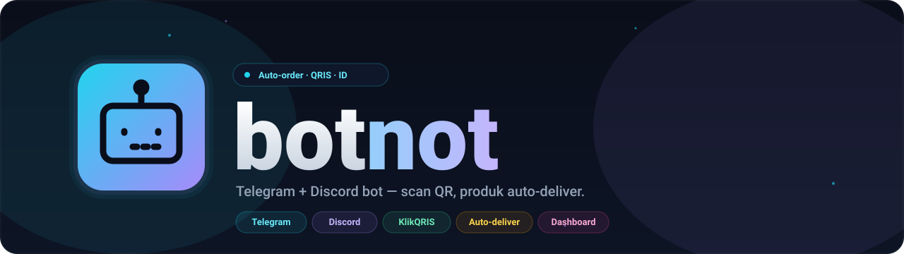

<p align="center">
  
</p>

<p align="center">
  <b>Bot auto-order untuk Telegram &amp; Discord, terintegrasi dengan <a href="https://klikqris.com">KlikQRIS</a> (QRIS Indonesia).</b><br>
  Pelanggan tinggal scan QR &mdash; produk dikirim otomatis lewat DM begitu pembayaran masuk.
</p>

<p align="center">
  <a href="#license"></a>
  
  
  
  
</p>

---

## Daftar Isi

- [Fitur](#fitur)
- [Cara Kerja](#cara-kerja)
- [Tech Stack](#tech-stack)
- [Quick Start](#quick-start)
- [Cara Dapat Kredensial](#cara-dapat-kredensial)
  - [Telegram Bot Token](#1-telegram-bot-token)
  - [Discord Bot Token](#2-discord-bot-token)
  - [KlikQRIS API Key](#3-klikqris-api-key)
- [Konfigurasi `.env`](#konfigurasi-env)
- [Webhook Public URL](#webhook-public-url)
- [Struktur Project](#struktur-project)
- [Perintah Bot](#perintah-bot)
- [Deploy ke Production](#deploy-ke-production)
- [Roadmap](#roadmap)
- [Kontribusi](#kontribusi)
- [License](#license)

---

## Fitur

- **Multi-platform**: Telegram + Discord dari satu codebase, satu database, satu webhook.
- **QRIS dinamis**: tiap order dapet QR unik via API KlikQRIS, scan pakai e-wallet apa pun (GoPay, OVO, Dana, ShopeePay, m-banking, dll).
- **Auto-deliver**: stok (akun, license key, voucher, file) otomatis dikirim ke DM pembeli setelah pembayaran terkonfirmasi.
- **Idempotent webhook**: pengecekan status di DB mencegah kirim produk dobel kalau callback masuk berulang.
- **Signature validation**: webhook divalidasi dengan signature yang disimpan saat create transaction (anti fake-callback).
- **Stock management**: alokasi stok pakai DB transaction, anti race condition kalau dua orang beli barengan.
- **Configurable**: SQLite untuk dev, tinggal ganti `DATABASE_URL` ke Postgres untuk production.

## Cara Kerja

```
  ┌─────────────┐     ┌─────────────┐
  │  Telegram   │     │   Discord   │
  │  pelanggan  │     │  pelanggan  │
  └──────┬──────┘     └──────┬──────┘
         │ /buy <id>         │ /buy product_id:<id>
         ▼                   ▼
       ┌─────────────────────────┐
       │       botnot core       │
       │  (Fastify + grammy +    │
       │       discord.js)       │
       └────┬───────────────┬────┘
            │               │
            │ create        │ store order
            ▼               ▼
       ┌──────────┐    ┌──────────┐
       │ KlikQRIS │    │ Database │
       └────┬─────┘    └────▲─────┘
            │ webhook PAID   │ update + allocate stok
            └────────────────┘
                     │
                     ▼ DM pembeli
                ┌─────────┐
                │ Produk  │
                │ terkirim│
                └─────────┘
```

1. Pembeli ketik `/buy <product_id>` di Telegram atau Discord.
2. Bot panggil `/qris/create` ke KlikQRIS, simpan `signature` & `total_amount` di DB.
3. Bot kirim gambar QR + nominal + waktu kadaluarsa ke pembeli.
4. Pembeli scan QR, bayar pakai e-wallet apa pun.
5. KlikQRIS hit `POST /webhook/klikqris` di server kamu.
6. Webhook handler:
   1. Validasi signature.
   2. Cek idempotency (kalau sudah `PAID`, abaikan).
   3. Update status order ke `PAID`.
   4. Alokasi stok dalam DB transaction.
   5. Kirim produk lewat DM Telegram/Discord.

## Tech Stack

| Layer        | Tool                                        |
| ------------ | ------------------------------------------- |
| Runtime      | Node.js 20+ (ESM, NodeNext)                 |
| Bahasa       | TypeScript 5                                |
| Telegram bot | [grammy](https://grammy.dev)                |
| Discord bot  | [discord.js](https://discord.js.org) v14    |
| HTTP server  | [Fastify](https://fastify.dev) v5           |
| ORM          | [Prisma](https://www.prisma.io)             |
| DB           | SQLite (dev) / PostgreSQL (prod)            |
| Validasi env | [zod](https://zod.dev)                      |
| Logging      | [pino](https://getpino.io) + pino-pretty    |
| HTTP client  | axios                                       |

---

## Quick Start

> Butuh **Node.js 20+** dan **npm** (atau pnpm/yarn).

```bash
# 1. Clone repo
git clone https://github.com/mocasus/botnot.git
cd botnot

# 2. Install dependencies
npm install

# 3. Setup environment variables
cp .env.example .env
# Edit .env, isi KLIKQRIS_*, TELEGRAM_BOT_TOKEN, DISCORD_BOT_TOKEN, DISCORD_CLIENT_ID
# (panduan ada di section "Cara Dapat Kredensial" di bawah)

# 4. Setup database (SQLite, default ada di prisma/dev.db)
npm run db:push
npm run db:seed     # opsional: isi contoh produk

# 5. Jalanin (webhook + Telegram bot + Discord bot, satu proses)
npm run dev
```

Output kira-kira:

```
[12:34:56] INFO: Webhook server listening port=3000
[12:34:57] INFO: Telegram bot started username=botnot_bot
[12:34:58] INFO: Discord slash commands registered scope=guild
[12:34:58] INFO: Discord bot ready tag=botnot#1234
```

Buka chat Telegram dengan bot kamu, ketik `/start` &mdash; siap testing!

---

## Cara Dapat Kredensial

### 1. Telegram Bot Token

1. Buka aplikasi Telegram, search **`@BotFather`** dan mulai chat.
2. Kirim perintah: `/newbot`
3. BotFather minta 2 hal:
   - **Display name** (bebas, misal: `Toko Otomatis`)
   - **Username** (harus unik & diakhiri `bot`, misal: `tokootomatis_bot`)
4. BotFather balas dengan token format:
   ```
   123456789:ABCdefGhIJklmNOpqrSTUvwxYZ-1234567890
   ```
   Copy token ini ke `TELEGRAM_BOT_TOKEN` di `.env`.
5. **Opsional** &mdash; biar bot keliatan rapi:
   - `/setdescription` — deskripsi bot
   - `/setuserpic` — kirim gambar untuk avatar
   - `/setcommands` — daftar command yang muncul di tombol menu, contoh:
     ```
     start - Mulai
     catalog - Lihat daftar produk
     buy - Beli produk
     ```

### 2. Discord Bot Token

1. Buka **[Discord Developer Portal](https://discord.com/developers/applications)** dan login.
2. Klik **`New Application`**, kasih nama (misal: `Botnot`), klik **Create**.
3. Di sidebar pilih **`Bot`**:
   - Klik **`Reset Token`** &rarr; copy token-nya. **Token cuma muncul sekali!** Simpan ke `DISCORD_BOT_TOKEN`.
   - (Opsional) Matikan toggle **`Public Bot`** kalau bot ini private.
4. Di sidebar pilih **`General Information`**:
   - Copy **`Application ID`** &rarr; ini yang kita pakai sebagai `DISCORD_CLIENT_ID` di `.env`.
5. **Invite bot ke server kamu**:
   - Sidebar &rarr; **`OAuth2`** &rarr; **`URL Generator`**.
   - Centang scope: `bot`, `applications.commands`.
   - Centang Bot Permissions: `Send Messages`, `Embed Links`, `Attach Files`, `Use Slash Commands`.
   - Copy URL yang dihasilkan, buka di browser, pilih server, klik **Authorize**.
6. **Opsional &mdash; Guild ID untuk testing cepat**:
   - Slash command global butuh waktu propagasi sampai 1 jam. Untuk dev, daftarkan ke 1 guild aja biar instan.
   - Aktifkan Developer Mode: Discord &rarr; Settings &rarr; Advanced &rarr; **Developer Mode** ON.
   - Right-click icon server kamu &rarr; **Copy Server ID** &rarr; paste ke `DISCORD_GUILD_ID` di `.env`.
   - Untuk production, kosongkan `DISCORD_GUILD_ID` biar pakai global commands.

> **Catatan penting Discord:** bot hanya bisa kirim DM ke user yang **berbagi minimal satu server** dengan bot. Buat server "lobby" dan minta pelanggan join sebelum membeli, atau kirim hasil order ke channel publik dengan @mention sebagai fallback.

### 3. KlikQRIS API Key

1. Daftar/login akun merchant di **[klikqris.com](https://klikqris.com)**.
2. Buka dashboard merchant, copy:
   - `x-api-key` &rarr; isi ke `KLIKQRIS_API_KEY`
   - `id_merchant` &rarr; isi ke `KLIKQRIS_MERCHANT_ID`
3. Daftarkan **Webhook URL** kamu di dashboard, format:
   ```
   https://<domain-public-kamu>/webhook/klikqris
   ```
4. **JANGAN PERNAH** commit `.env` ke git. File `.gitignore` sudah meng-ignore `.env*` (kecuali `.env.example`).

---

## Konfigurasi `.env`

```bash
NODE_ENV=development
PORT=3000

# KlikQRIS
KLIKQRIS_API_BASE=https://klikqris.com/api
KLIKQRIS_API_KEY=          # x-api-key dari dashboard
KLIKQRIS_MERCHANT_ID=      # id_merchant

# Telegram
TELEGRAM_BOT_TOKEN=        # dari @BotFather

# Discord
DISCORD_BOT_TOKEN=         # dari Developer Portal > Bot
DISCORD_CLIENT_ID=         # = Application ID
DISCORD_GUILD_ID=          # opsional, isi untuk dev (slash command instan)

# Database
DATABASE_URL="file:./prisma/dev.db"

# Webhook
PUBLIC_BASE_URL=           # contoh: https://abc123.ngrok.io
```

---

## Webhook Public URL

KlikQRIS perlu URL public untuk kirim callback. Untuk testing lokal, pakai tunnel:

**Pakai ngrok**:

```bash
# install: https://ngrok.com/download
ngrok http 3000
# copy URL https://xxxx.ngrok.io
# daftarkan https://xxxx.ngrok.io/webhook/klikqris di dashboard KlikQRIS
```

**Pakai Cloudflare Tunnel** (gratis, tanpa daftar):

```bash
cloudflared tunnel --url http://localhost:3000
```

Untuk production: deploy ke VPS / Railway / Fly.io / Render dan pakai domain HTTPS milik kamu.

---

## Struktur Project

```
botnot/
├── assets/
│   └── logo.svg
├── prisma/
│   ├── schema.prisma         # Product, Stock, Order
│   └── seed.ts               # contoh data
├── src/
│   ├── bots/
│   │   ├── telegram.ts       # /start /catalog /buy
│   │   ├── discord.ts        # slash commands
│   │   └── registry.ts       # shared bot instances
│   ├── orders/
│   │   ├── service.ts        # createOrder, markOrderPaid
│   │   └── delivery.ts       # auto-deliver stok ke pembeli
│   ├── payment/
│   │   ├── klikqris.ts       # client API
│   │   └── webhook.ts        # POST /webhook/klikqris
│   ├── products/catalog.ts
│   ├── config.ts             # zod-validated env
│   ├── db.ts                 # prisma client
│   ├── logger.ts             # pino
│   └── index.ts              # entrypoint
├── .env.example
├── package.json
└── tsconfig.json
```

---

## Perintah Bot

### Telegram

| Command                 | Deskripsi                          |
| ----------------------- | ---------------------------------- |
| `/start`                | Welcome message + daftar perintah  |
| `/catalog`              | Lihat semua produk + harga + stok  |
| `/buy <product_id>`     | Beli 1 unit                        |
| `/buy <product_id> <n>` | Beli `n` unit                      |

### Discord

| Slash Command                            | Deskripsi               |
| ---------------------------------------- | ----------------------- |
| `/catalog`                               | Lihat semua produk      |
| `/buy product_id:<id>`                   | Beli 1 unit             |
| `/buy product_id:<id> qty:<n>`           | Beli `n` unit           |

### Tambah produk

Pakai Prisma Studio:

```bash
npm run db:studio
# buka http://localhost:5555, edit tabel Product & Stock
```

Atau edit `prisma/seed.ts` lalu jalanin `npm run db:seed`.

---

## Deploy ke Production

1. **Database**: ganti SQLite ke PostgreSQL (Neon/Supabase/Railway):
   ```prisma
   // prisma/schema.prisma
   datasource db {
     provider = "postgresql"
     url      = env("DATABASE_URL")
   }
   ```
2. **Build**:
   ```bash
   npm run build
   npm run db:migrate deploy
   npm start
   ```
3. **Process manager**: pakai `pm2`, `systemd`, atau Docker.
4. **Public HTTPS**: wajib untuk webhook KlikQRIS. Pakai reverse proxy (Caddy/Nginx) atau hosting yang bawa HTTPS otomatis.
5. **Environment**: set `NODE_ENV=production` biar log JSON (lebih ringan).

---

## Roadmap

- [ ] Cron auto-expire order yang stuck `PENDING`
- [ ] Retry queue (BullMQ + Redis) untuk delivery yang gagal
- [ ] Admin commands: tambah produk, restok, lihat orderan, refund
- [ ] Notifikasi WhatsApp via flag `notifwa` KlikQRIS
- [ ] Dashboard web (Next.js) untuk monitoring penjualan
- [ ] Integrasi role Discord otomatis (untuk produk tipe `ROLE`)
- [ ] Unit & integration tests

---

## Kontribusi

PR sangat welcome! Cara kontribusi:

1. Fork repo ini
2. Buat branch: `git checkout -b feat/nama-fitur`
3. Commit: `git commit -m "feat: deskripsi"`
4. Push: `git push origin feat/nama-fitur`
5. Buka Pull Request ke branch `main`

Issue untuk laporan bug atau request fitur juga sangat membantu!

---

## License

Dilisensikan di bawah [MIT License](./LICENSE) &mdash; bebas digunakan, dimodifikasi, dan didistribusikan, termasuk untuk keperluan komersial.

---

<p align="center">
  Dibuat untuk komunitas seller digital Indonesia.<br>
  <i>Kalau berguna, kasih bintang &#x2B50; ya!</i>
</p>
